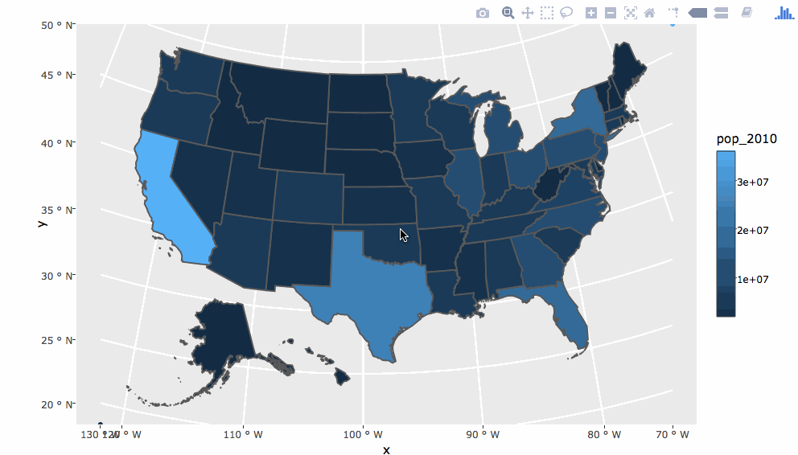

```{r setup, echo = FALSE}
knitr::opts_chunk$set(
  message = FALSE,
  fig.width = 12.5,
  fig.height = 5,
  comment = "#>",
  collapse = TRUE,
  eval = FALSE
)
```

```{r, eval = TRUE, echo = FALSE}
library(plotly)
library(crosstalk)
```

## About me

* PhD in statistics from Iowa State (defended in December)
    * Taught intro to business statistics for 4 years. 
    * __Thesis:__ Interfacing R with Web Technologies for Interactive Statistical Graphics and Computing
with Data

* Maintainer of plotly's R package (for nearly 2 years!)
    * Authored the [plotly book](https://plotly-book.cpsievert.me/) in 2016
    * Received the John M. Chambers Statistical Software Award in 2017
    
* Author of many [other R packages](https://cpsievert.me/software/) 
    * LDAvis, animint, pitchRx, rdom, etc

* Delivered a handful of R [workshops](https://workshops.cpsievert.me)
    * Most recently (solely) delivered an R workshop at [plotcon](https://plotcon.plot.ly/)

---
class: inverse, center, middle

## About my workshops

Attendees expected to bring laptop.

Materials are published online (under Creative Commons).

Blend of lecture, coding demos, and hands-on exercises.

Works best with 5-20 attendees.

---

## About this workshop

* Mostly a re-hash of my [plotcon workshop](https://plotcon17.cpsievert.me/workshop/)

* Day 1: Getting (re)-acquainted with R, RStudio, data wrangling, ggplot2, and plotly
  * Basic R syntax and data structures
  * Using `ggplotly()` to convert ggplot2 to plotly
  * Using `layout()`/`style()` to modify plotly objects
  * Tips and info for getting "un-stuck"
    
* Day 2: Advanced plotly
  * Animation
  * Highlighting/filtering in multiple linked views
  * Capturing plotly events in shiny

---
class: inverse, center, middle

# Some examples

---

```{r}
library(plotly)
usa <- albersusa::usa_sf("laea")
p <- ggplot(usa) + geom_sf(aes(fill = pop_2010)) 
ggplotly(p)
```


<iframe src="map.html" width="100%" height="600" scrolling="no" seamless="seamless" frameBorder="0"></iframe>

---

## Various ways to customize

```{r}
p <- ggplot(usa) + 
  geom_sf(aes(fill = pop_2010, text = paste(name, "had", pop_2010, "\n in 2010"))) 
style(ggplotly(p, tooltip = "text"), hoverlabel = list(bgcolor = "white"))
```

<iframe src="map2.html" width="100%" height="600" scrolling="no" seamless="seamless" frameBorder="0"></iframe>

---

## Define custom interactions

<iframe src="map-outline.html" width="100%" height="600" scrolling="no" seamless="seamless" frameBorder="0"></iframe>

---

## The code

```{r}
library(crosstalk)
usd <- SharedData$new(usa)
p <- ggplot(usd) + geom_sf(aes(fill = pop_2010))
highlight(
  ggplotly(p), "plotly_hover", opacityDim = 0.8,
  selected = attrs_selected(line = list(color = "black"))
)
```

---

## Annotate on click



---

## Highlighting in small multiples

```{r, eval = TRUE}
d <- subset(txhousing, city %in% c("Galveston", "Midland", "Odessa", "South Padre Island"))
sd <- SharedData$new(d, ~year)
p <- ggplot(sd, aes(month, median, group = year)) + geom_line() +
  facet_wrap(~city, ncol = 2)
gg <- ggplotly(p, tooltip = "year")
highlight(gg, on = "plotly_click")
```

---

## Making comparisons with dynamic brush

```{r}
highlight(
  gg, on = "plotly_click", dynamic = TRUE, persistent = TRUE, selectize = TRUE
)
```

<iframe src="selectize.html" width="100%" height="420" scrolling="no" seamless="seamless" frameBorder="0"> </iframe>


---

## Animation

```{r, eval = TRUE, warning = FALSE}
p <- ggplot(sd, aes(month, median)) + 
  geom_line(aes(group = year), alpha = 0.2) +
  geom_line(aes(frame = year), color = "red") +
  facet_wrap(~city, ncol = 2)
ggplotly(p) %>% animation_opts(1000)
```

---

## Filter

```{r}
s <- filter_select("years", "Years", sd, ~year)
p <- ggplot(sd, aes(month, median, group = year)) + geom_line() + facet_wrap(~city, ncol = 2, scales = "free")
htmltools::tagList(s, ggplotly(p, dynamicTicks = T))
```

<iframe src="filter.html" width="100%" height="420" scrolling="no" seamless="seamless" frameBorder="0"> </iframe>

---

## Summary

* The `ggplotly()` function makes it easy to create easy interactive graphics via **ggplot2**.
* Any plotly R object may be modified/customized via the [plotly.js figure reference](https://plot.ly/r/reference/).
* Crosstalk's `SharedData` class may be leveraged to:
  * Pose queries (via indirect/indirect manipulation)
  * Make comparisons (via persistent/dynamic highlighting)

---
class: center, middle, inverse

# Thanks!

Twitter: [@cpsievert](https://twitter.com/cpsievert) <br />
GitHub: [@cpsievert](https://github.com/cpsievert) <br />
Email: <cpsievert1@gmail.com> <br />
Web: <https://cpsievert.me>

