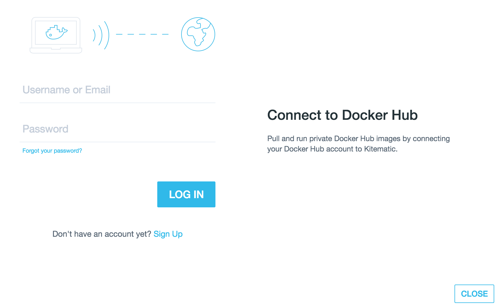
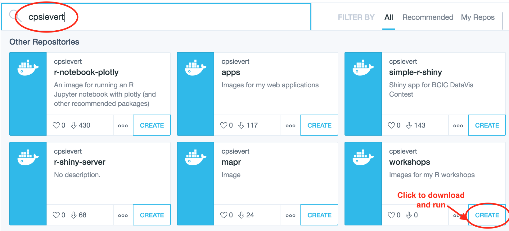
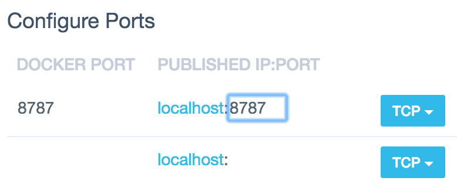
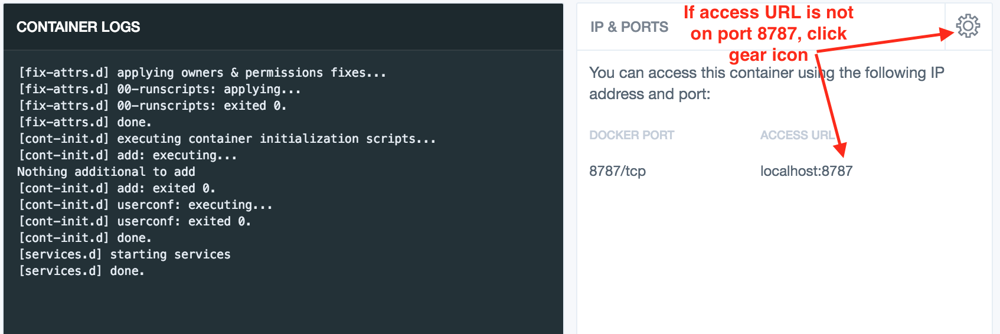
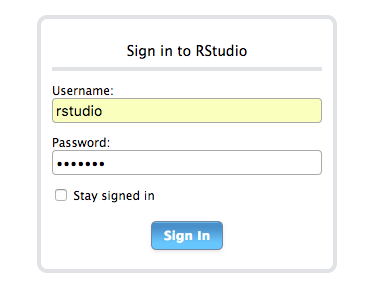
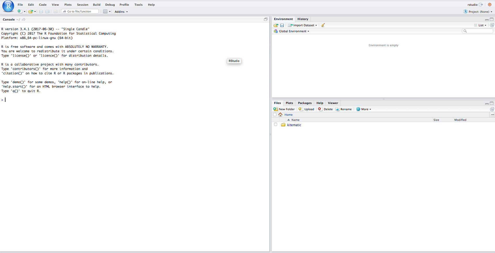

```{r, include= FALSE}
library(knitr)
library(tufte)
opts_chunk$set(
  echo = FALSE,
  message = FALSE,
  warning = FALSE,
  comment = "#>",
  collapse = TRUE
)
```


# Our philosophy

This workshop is _not_ designed to make you an R programming expert -- it's designed to get you [doing powerful things quickly](http://varianceexplained.org/r/teach-hard-way/) regardless of your experience with R or programming in general. The goal of the workshop is to accomplish data analysis tasks in an reproducible/efficient/scalable way and present the fruits of your labor in engaging/compelling/portable ways. In order to reach that goal, we do use R as a tool, and will cover some programming concepts, but programming is always treated as a means to an end (not an end to the means).

This workshop is also designed to be highly interactive -- attendees are expected to intermittently complete exercises. To participate in the exercises, attendees will want access to a computer/laptop with relevant software installed **prior to the workshop**. Click [here](#installation) for installation directions.


# Installation

## Docker

`r margin_note("NOTE: if you already have Docker and are comfortable running terminal commands, you can skip most of these directions and run:")`
`r margin_note("<code>docker run -p 8787:8787 cpsievert/workshops-20171118</code>")`

[Docker](https://www.docker.com/) provides the most seamless installation experience and *guarantees* consistency in computational results (which is why I highly recommend this installation approach). If you don't already have Docker, or have never heard of it, don't worry! I'll walk you through how to use it for our purposes. First off, download and install the [Docker toolbox](https://www.docker.com/products/docker-toolbox) (completely free to use!). The toolbox ships with a number of things, one of them being a graphical interface called Kitematic which makes it easy to find/download/use Docker images. After installing the Docker toolbox, you should be able to find Kitematic in your applications. Go ahead and open it. You should see a welcome page like this:


```{r}

```

There is no need to create a Docker Hub account (so go ahead and press 'skip' or 'close'), but we'll be downloading an image I've provided [specifically for this workshop](https://hub.docker.com/r/cpsievert/workshops-20171118) from Docker Hub. To download it, just type 'cpsievert' in the search bar and 'create' the relevant image: 

```{r}

```

This will download the image, which may take a few minutes (we're downloading an entire virtual machine!). Once the image is done downloading, you should see something similar to this:

```{r, fig.margin = TRUE, fig.cap = 'You might need to map docker port 8787 to port 8787 on the host (click gear icon, then go to "Configure Ports" section of the "Hostname/Ports" tab)'}

```

```{r}

```


Finally, point your web browser to <http://locahost:8787>, and you'll see a log-in page for RStudio. Enter 'rstudio' for both the username and password. Once you see an RStudio window like this one, high-five yourself; you're all set up for the workshop! `r emo::ji("tada")` `r emo::ji("tada")` `r emo::ji("tada")`

```{r, fig.margin = TRUE, fig.cap = "RStudio login"}

```

```{r}

```

## Manual Installation

If, for some reason, the docker approach doesn't fit your needs, you can try installing the software dependencies by hand. A bit of warning, this approach is almost guaranteed to cause more headaches than the docker approach. That being said, first off, make sure you are set up with [prerequisites for building R packages](https://support.rstudio.com/hc/en-us/articles/200486498-Package-Development-Prerequisites). At that point, you can try installing all the R packages necessary for this workshop by doing:

```r
# first, make sure your packages are up-to-date, then install R packages for this workshop
update.packages(ask=FALSE)
devtools::install_github('cpsievert/workshops/20171118')
```