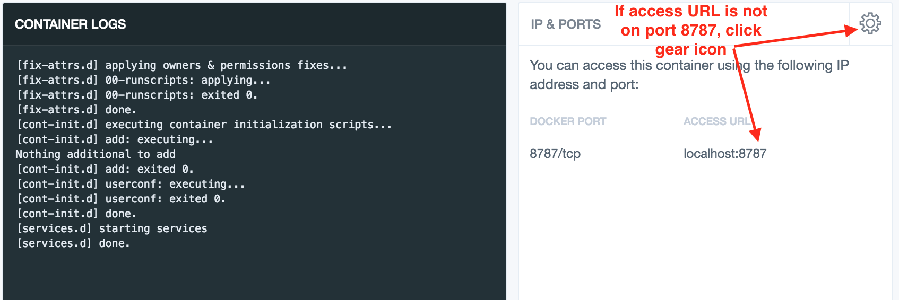

# Plotcon 2018 workshop
[Carson Sievert](https://cpsievert.me/)  
King's College, New York, NY <br /> November 18-19th, 2017  


# About the workshop

This workshop is highly interactive. Attendees are expected to participate in hands-on exercises which augment the lecture material and are encouraged to ask questions. To participate in the exercises, attendees should bring a laptop with relevant software installed **prior to the workshop**. Click [here](#installation) for installation directions.

By the end of this workshop, you should be able to leverage interactive visualization techniques to perform/present data analysis tasks/findings using [the R package plotly](https://plot.ly/r/). Though it would be beneficial to have some prior knowledge of R and [ggplot2](http://ggplot2.tidyverse.org/), we do not require it, and as such, we avoid assuming pre-existing knowledge as much as possible. Furthermore, this workshop is _not_ designed to make you an R programming expert -- it's designed to get you [doing powerful things quickly](http://varianceexplained.org/r/teach-hard-way/) regardless of your experience with R or programming in general.


# Installation

## Docker

<label for="tufte-mn-" class="margin-toggle">&#8853;</label><input type="checkbox" id="tufte-mn-" class="margin-toggle"><span class="marginnote">NOTE: if you already have Docker and are comfortable running terminal commands, you can skip most of these directions and run:</span>
<label for="tufte-mn-" class="margin-toggle">&#8853;</label><input type="checkbox" id="tufte-mn-" class="margin-toggle"><span class="marginnote"><code>docker run -p 8787:8787 cpsievert/workshops:20171118</code></span>

[Docker](https://www.docker.com/) provides the most seamless installation experience and *guarantees* consistency in computational results (which is why I highly recommend this installation approach). If you don't already have Docker, or have never heard of it, don't worry! I'll walk you through how to use it for our purposes. First off, download and install the [Docker toolbox](https://www.docker.com/products/docker-toolbox) (completely free to use!). The toolbox ships with a number of things, one of them being a graphical interface called Kitematic which makes it easy to find/download/use Docker images. After installing the Docker toolbox, you should be able to find Kitematic in your applications. Go ahead and open it. You should see a welcome page like this:


There is no need to create a Docker Hub account (so go ahead and press 'skip' or 'close'), but we'll be downloading an image I've provided [specifically for this workshop](https://hub.docker.com/r/cpsievert/workshops) from Docker Hub. To download it, just type 'cpsievert' in the search bar and 'create' the relevant image: 


This will download the image, which may take a few minutes (we're downloading an entire virtual machine!). Once the image is done downloading, you should see something similar to this:

<p><span class="marginnote shownote"><!--
<div class="figure">-->

<!--
<p class="caption marginnote">-->You might need to map docker port 8787 to port 8787 on the host (click gear icon, then go to "Configure Ports" section of the "Hostname/Ports" tab)<!--</p>-->
<!--</div>--></span></p>




Finally, point your web browser to <http://locahost:8787>, and you'll see a log-in page for RStudio. Enter 'rstudio' for both the username and password. Once you see an RStudio window like this one, high-five yourself; you're all set up for the workshop! 🎉 🎉 🎉

<p><span class="marginnote shownote"><!--
<div class="figure">-->

<!--
<p class="caption marginnote">-->Use 'rstudio' for both login and password.<!--</p>-->
<!--</div>--></span></p>


## Manual Installation

If, for some reason, the docker approach doesn't fit your needs, you can try installing the software dependencies by hand. A bit of warning, this approach is almost guaranteed to cause more headaches than the docker approach. That being said, first off, make sure you are set up with [prerequisites for building R packages](https://support.rstudio.com/hc/en-us/articles/200486498-Package-Development-Prerequisites). At that point, you can try installing all the R packages necessary for this workshop by doing:

```r
# first, make sure your packages are up-to-date, then install R packages for this workshop
update.packages(ask=FALSE)
devtools::install_github('cpsievert/workshops/20171118')
```
