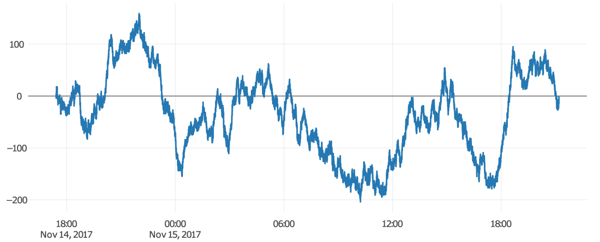

class: inverse, center
background-image: url(../your-turn.jpeg)
background-size: contain

## Your Turn

(1) Install the required software <https://workshops.cpsievert.me/20171118/>

(2) Run the docker container so that RStudio appears when you visit <http://localhost:8787> (in Chrome or Firefox, please!)

(3) Using the Files pane in RStudio, click `day1` folder, then `index.html`, and choose 'View in web browser'.

(4) Share (with your neighbor) 3 things you're hoping to take away from this workshop (share them with me, via [Slack](https://plotconrworkshop.slack.com) if you like!)

.footnote[
PS. remember this background image -- it means I want something from you!
]

---

### About me

* Maintainer of plotly's R package (for nearly 3 years!)
    * Before that: animint, LDAvis, pitchRx, rdom
* PhD in statistics from Iowa State
    * Thesis: [Interfacing R with Web Technologies for Interactive Statistical Graphics and Computing with Data](https://search.proquest.com/openview/3a91971f82fd4af20a78bebb079f5035/1.pdf?pq-origsite=gscholar&cbl=18750&diss=y)
* Founder & CEO, [Sievert Consulting LLC](https://consulting.cpsievert.me/)
    * Currently looking for more projects!

---
## About the attendees

<iframe src="attendees.html" width="100%" height="450" scrolling="no" seamless="seamless" frameBorder="0"> </iframe>

<https://plot.ly/ggplot2/geom_density/>

---
## About the attendees, another look

<iframe src="attendees2.html" width="100%" height="450" scrolling="no" seamless="seamless" frameBorder="0"> </iframe>

<https://plot.ly/r/parallel-coordinates-plot/>


---
## Is there anything in particular that you would like covered?

* I'm most interested in **linking and animating views without shiny**. Already pretty well acquainted with R/RStudio/Plotly, but hoping to learn how to use Plotly more efficiently and extend my current usage with animation, crosstalk, etc.  I use Plotly most often within flexdashboard applications, so most interested in non-Shiny options.
* I want to learn how to **animate my plotly graphs/charts.**
* More **shiny** dev
* **Creating documents with data visualizations in Markdown files**. I've been working to get better with Markdown, but if there's a way to include interactive visualizations and/or animations in Markdown files that can be sent to readers that would be great. I work in consulting so I often need to send reports to executives and including interactive data visualizations in those reports would be incredibly useful for me.
* Looks good! Stoked for the class. For me, I **don't use rmarkdown** and rarely use ggplot2 - so those could be dropped from the list.
* Looks like all of Day1 currently would be old news. Wouldn't **half a day of R/RStudio/ggplot2** suffice for your audience?

---
## Is there anything else that we can help you with at the workshop?

* I'd like to know how plotly performs with displaying **large data** sets
* Plotting large amounts of **time series** data efficiently
* Plotly custom **controls and mapping** options. 
* Learn how to apply **interactive filters** in Plotly if that's supported (e.g. click on a single bar within a bar chart on the left which filters the heat-map to the right). 
* More advanced visualization techniques such as a chord diagram or a sunburst 
  * Check out [sunburstR](https://github.com/timelyportfolio/sunburstR)
* Suggestions/hints on how to create clean, **good code** would be especially appreciated.
  * Check out [tidyverse](https://www.tidyverse.org/)
* **Extended breakout session** time for help on specific project i am bringing 

---
## Is there anything else that we can help you with at the workshop?

* I'd like to know how plotly performs with displaying **large data** sets
* Plotting large amounts of **time series** data efficiently
* Plotly custom **controls and mapping** options. 
* Learn how to apply **interactive filters** in Plotly if that's supported (e.g. click on a single bar within a bar chart on the left which filters the heat-map to the right). 
* More advanced visualization techniques such as a chord diagram or a sunburst 
  * Check out [sunburstR](https://github.com/timelyportfolio/sunburstR)
* Suggestions/hints on how to create clean, **good code** would be especially appreciated.
  * Check out [tidyverse](https://www.tidyverse.org/)
* **Extended breakout session** time for help on specific project i am bringing 

.footnote[
### I'll try my best -- 2 days is not enough!
### Please please please stop me and ask questions
]

```{r, include = FALSE}
library(plotly)
knitr::opts_chunk$set(
  eval = FALSE,
  message = FALSE,
  warning = FALSE,
  comment = "#>",
  collapse = TRUE,
  fig.width = 12,
  fig.height = 6
)
```

---
## A minimal bar chart

* Every **plotly** chart is powered by [plotly.js](https://github.com/plotly/plotly.js), plus some extra R/JS magic `r emo::ji("tophat")` `r emo::ji("rabbit")`.
* How/why did `plot_ly()` draw a bar chart? What if we want something different?

```{r}
library(plotly)
plot_ly(x = c("A", "B"), y = 1:2)
```

<iframe src="01-simple-bar.html" width="100%" height="400" scrolling="no" seamless="seamless" frameBorder="0"> </iframe>

---
class: inverse, center
background-image: url(../your-turn.jpeg)
background-size: contain

## Your Turn

Open the `day1/your-turn/01.R` script and work through the comments/code/questions.

Feel free to work with your neighbor and ask me questions!

---

The **scatter** trace type is quite general and syntax extends to WebGL (scattergl), 3D (scatter3d), Geo (scattergeo), and [mapbox](https://www.mapbox.com/) (scattermapbox).

```{r}
subplot(shareY = TRUE,
  plot_ly(x = 1:2, y = 1:2),
  plot_ly(x = 1:2, y = 1:2, mode = "lines"),
  plot_ly(x = 1:2, y = 1:2, mode = "markers+lines"),
  plot_ly(x = 1:2, y = 1:2, text = 1:2, mode = "text"),
  plot_ly(x = 1:2, y = 1:2, text = 1:2, mode = "markers+lines+text")
)
```

<iframe src="02-scatter-modes.html" width="100%" height="400" scrolling="no" seamless="seamless" frameBorder="0"> </iframe>

---
class: inverse, middle, center


# Working with actual data

Follow along with me using the `day1/demo/01.R` script.

---
## Which visualization is better?

```{r}
subplot(shareX = TRUE, nrows = 2,
  plot_ly(logs, x = ~date, y = ~package, z = ~count, type = "heatmap"),
  plot_ly(logs, x = ~date, y = ~count, color = ~package, mode = "lines")
)
```

<iframe src="03-heatmap.html" width="100%" height="400" scrolling="no" seamless="seamless" frameBorder="0"> </iframe>

---
background-image: url(bostock-heer-groups.png)
background-size: contain

## Famous question: which is larger (and by how much)? <font color="#DEE5FF">A</font> or <font color="#FDDFA4">B</font>?

.footnote[
These questions drive at least two influential papers:

* [Cleveland and McGill (1984)](http://info.slis.indiana.edu/~katy/S637-S11/cleveland84.pdf)
* [Bostock and Heer (2010)]()

This figure is from [Data Visualization for Social Science](http://socviz.co/) (highly recommended!) in reference to Bostock and Heer.
]

---
background-image: url(bostock-heer-findings.png)
background-size: contain

## Position is best, especially along common scale and baseline

.footnote[
Figure from [Heer and Bostock (2010)](http://vis.stanford.edu/files/2010-MTurk-CHI.pdf)
]

---
background-image: url(hierarchy.png)
background-size: contain

## A more general guideline from Cleveland and McGill 

.footnote[
* Figure from [Data Points: Visualization That Means Something](https://issuu.com/wiley_publishing/docs/data_points_sample_a15b4e87f1b924) by Nathan Yau
]

---
class: center, inverse, middle

# Interactive techniques can aid in these tasks

---
## Again, which is better?

<iframe src="03-heatmap.html" width="100%" height="550" scrolling="no" seamless="seamless" frameBorder="0"> </iframe>

---
background-image: url(https://klientboost.com/wp-content/uploads/2015/11/ppc-gold-mines.gif)
background-size: contain
class: inverse

<br />
<br />
<br />
<br />
<br />
<br />
<br />
<br />
<br />
<br />
<br />
<br />
<br />


## &nbsp; &nbsp; &nbsp; &nbsp; &nbsp; &nbsp; &nbsp; &nbsp; &nbsp; Graphing 5 time series 

## &nbsp; &nbsp; &nbsp; &nbsp; &nbsp; &nbsp; &nbsp; &nbsp; &nbsp; &nbsp; &nbsp;&nbsp; &nbsp; &mdash;&mdash;&mdash;&mdash;&mdash;&mdash;&mdash;&mdash;&mdash;&mdash;

---
background-image: url(https://klientboost.com/wp-content/uploads/2015/11/ppc-gold-mines.gif)
background-size: contain
class: inverse

<br />
<br />
<br />
<br />
<br />
<br />
<br />
<br />
<br />
<br />
<br />
<br />
<br />


## &nbsp; &nbsp; &nbsp; &nbsp; &nbsp; &nbsp; &nbsp; &nbsp; &nbsp; Graphing 5 time series 

## &nbsp; &nbsp; &nbsp; &nbsp; &nbsp; &nbsp; &nbsp; &nbsp; &nbsp; &nbsp; &nbsp;&nbsp; &nbsp; &mdash;&mdash;&mdash;&mdash;&mdash;&mdash;&mdash;&mdash;&mdash;&mdash;

<h1 align="right"> 1,000 time series!</h2>

---
## With all my `installed.packages()`, yikes!

```{r}
plot_ly(logs, x = ~date, y = ~count) %>% group_by(package) %>% add_lines(alpha=0.3)
```

<iframe src="04-lines.html" width="100%" height="500" scrolling="no" seamless="seamless" frameBorder="0"> </iframe>

---
## Can improve a bit with interaction

```{r}
library(crosstalk)
SharedData$new(logs, ~package) %>% 
  plot_ly(x = ~date, y = ~count) %>% group_by(package) %>% add_lines(alpha=0.3) %>% 
  highlight(dynamic = TRUE, selectize = TRUE, persistent = TRUE)
```

<iframe src="04-lines-b.html" width="100%" height="400" scrolling="no" seamless="seamless" frameBorder="0"> </iframe>


---
class: center, inverse, middle

# Overview first, then zoom and filter, then details on demand 

Ben Shneiderman


---
## [heatmaply](https://github.com/talgalili/heatmaply#readme) is awesome for visualizing a numeric matrices!

<iframe src="05-heatmaply.html" width="100%" height="550" scrolling="no" seamless="seamless" frameBorder="0"> </iframe>

---
class: inverse
background-image: url(../your-turn.jpeg)
background-size: contain

<h2 align="center"> Your turn </h2>

Have a look at some plotly "extension" packages!
  * [heatmaply](https://github.com/talgalili/heatmaply#readme)
  * [iheatmapr](https://github.com/ropensci/iheatmapr#readme)
  * [visdat](http://visdat.njtierney.com/articles/experimental_features.html#interactivity)
  * [vistime](https://github.com/shosaco/vistime#readme)
  * [ggplotgui](https://github.com/gertstulp/ggplotgui#readme)
  
  
.footnote[
**Exercise**: Most of these packages have a function that returns a plotly object (e.g., `heatmaply::heatmaply()`). Use a plotly function to modify/customize the result (e.g., add a title with `plotly::layout()`) 

For all CRAN packages that use plotly, see the "Reverse dependencies" section on <https://cran.r-project.org/package=plotly>
]

---
## What about *long* time series?

* 10,000s time series points renders with *SVG*

```{r}
y <- sample(c(-1, 1), 1e4, TRUE)
x <- seq(Sys.time(), Sys.time() + length(y) - 1, by = "1 sec")
plot_ly(x = x, y = cumsum(y)) %>% add_lines() %>% rangeslider()
```

<a href="06-rangeslider.html" target="_blank">
 <div align="center">
   
 </div>
</a>

---
## What about *long* time series?

* 100,000 or so time series points renders with *WebGL* (but [no rangeslider (yet)](https://community.plot.ly/t/is-there-a-way-to-keep-the-range-slider-while-using-scattergl/4556/3))

```{r}
y <- sample(c(-1, 1), 1e5, TRUE)
x <- seq(Sys.time(), Sys.time() + length(y) - 1, by = "1 sec")
plot_ly(x = x, y = cumsum(y)) %>% add_lines() %>% toWebGL()
```

<a href="07-webgl.html" target="_blank">
 <div align="center">
   
 </div>
</a>

---
## More time series tips

### Have *lots* of *long* time series?

* Consider projecting each series to a lower dimensional (feature) space. 
  * See [anomalous](https://github.com/robjhyndman/anomalous) package, for example.
  * See my work on [visualizing pedestrian traffic](https://github.com/cpsievert/pedestrians) with plotly
  * See [trelliscope](http://ryanhafen.com/blog/trelliscopejs-plotly)

### Is seasonality important?

* Consider "wrapping" your time-series 
  * Get inspired by this [paper](https://arxiv.org/pdf/1412.6675.pdf)
  * Checkout out [sugrrants](https://github.com/earowang/sugrrants) (`ggplotly()` converts the ggplot2 plots)
  * Wrap (i.e., group) your series by hand
  
### Visualization of models/predictions?

* Start with [forecast](https://cran.r-project.org/package=forecast) and/or [mgcv](https://cran.r-project.org/package=mgcv) for model fitting.
* Use a strategy similar to [here](https://plotly-book.cpsievert.me/a-case-study-of-housing-sales-in-texas.html#fig:forecast) to plot forecasts.

.footnote[
Time series has performance limitations that other data types don't. For instance, [if you really want to](https://www.youtube.com/watch?v=9nazm3_OXac), we can do a scatterplot of >1M points.
]

---
## Texas housing prices

```{r, eval = TRUE}
library(dplyr)
tx <- txhousing %>%
  select(city, year, month, median) %>%
  filter(city %in% c("Galveston", "Midland", "Odessa", "South Padre Island"))
tx
```

---
## Wrap by year, facet by city

```{r, eval = TRUE}
ggplot(tx, aes(month, median, group = year)) + geom_line() +
  facet_wrap(~city, ncol = 2)
```

---
## Compare across cities within year *and* across years within city

```{r}
TX <- SharedData$new(tx, ~year)
p <- ggplot(TX, aes(month, median, group = year)) + geom_line() +
  facet_wrap(~city, ncol = 2)
(gg <- ggplotly(p, tooltip = "year"))
```

<iframe src="08-small-multiples.html" width="100%" height="425" scrolling="no" seamless="seamless" frameBorder="0"> </iframe>

---
## Set selection mode and default selections

```{r}
highlight(gg, "plotly_hover", defaultValues = "2006")
```

<iframe src="08-modes.html" width="100%" height="425" scrolling="no" seamless="seamless" frameBorder="0"> </iframe>


---
## Make comparisons with dynamic brush

```{r}
highlight(gg, dynamic = TRUE, persistent = TRUE, selectize = TRUE)
```

<iframe src="08-dynamic.html" width="100%" height="500" scrolling="no" seamless="seamless" frameBorder="0"> </iframe>

---
## Customize the appearance of selections

```{r}
highlight(
  gg, dynamic = TRUE, persistent = TRUE, 
  selected = attrs_selected(mode = "markers+lines", marker = list(symbol = "x"))
)
```

<iframe src="08-custom.html" width="100%" height="400" scrolling="no" seamless="seamless" frameBorder="0"> </iframe>

---
## Automate queries via animation

```{r}
p <- ggplot(tx, aes(month, median)) + 
  geom_line(aes(group = year), alpha = 0.2) +
  geom_line(aes(frame = year), color = "red") +
  facet_wrap(~city, ncol = 2)
ggplotly(p)
```

<iframe src="08-automate.html" width="100%" height="400" scrolling="no" seamless="seamless" frameBorder="0"> </iframe>


---
class: inverse, center
background-image: url(../your-turn.jpeg)
background-size: contain


## Your turn

Visit this post and use trelliscope to visualize all of `txhousing` (or, preferably, your own data!)

<http://ryanhafen.com/blog/trelliscopejs-plotly>


---

End here and 

  * Refresh their memory with highlighting day 2.
  * Give them a whirlwind of examples, demonstrate power
  * Explain the framework, briefly
    * Interface for querying subsets of your _data_
    * Interface for altering parameters of the visualization requires knowing some JS/shiny
