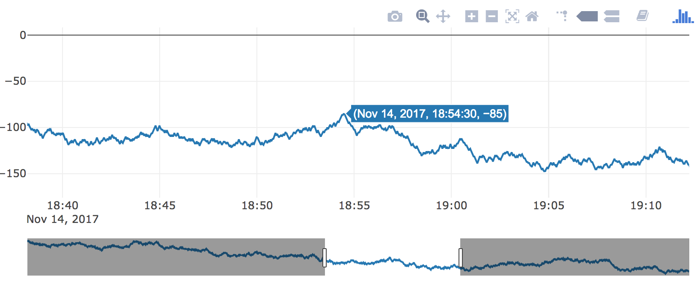

class: bottom, left
background-image: url(plotly-for-r.svg)
background-size: contain

# Welcome

## Thanks for coming!

---
class: inverse, center
background-image: url(../your-turn.jpeg)
background-size: contain

## Your turn

(1) Go to this address <https://rstudio.cloud/project/14090>. Follow the directions you see in the 'hello.R' script.

(2) Share (w/ your neighbor) 3 things you're hoping to take away from this workshop (share them via Slack if you like!)


---
class: middle

<h3 align="center"> About me </h3>

* PhD in statistics at Iowa State with Heike Hofmann & Di Cook (Dec 2016) 
  
  * Thesis: [Interfacing R with web technologies](http://lib.dr.iastate.edu/etd/15422/)
  
* CEO of [Sievert Consulting](https://consulting.cpsievert.me/) LLC (Jan 2017)

  * Clients: plotly, NOAA, Sandia Labs, O'Reilly
  
* I `r emo::ji("heart")` interactive data visualization
  
  * Maintain/author R `r emo::ji("package")`s: plotly, LDAvis, animint

```{r, include = FALSE}
library(plotly)
knitr::opts_chunk$set(
  eval = FALSE,
  message = FALSE,
  warning = FALSE,
  comment = "#>",
  collapse = TRUE,
  fig.width = 12,
  fig.height = 6
)
```

---
## A minimal bar chart

* Every **plotly** chart is powered by [plotly.js](https://github.com/plotly/plotly.js), plus some extra R/JS magic `r emo::ji("tophat")` `r emo::ji("rabbit")`.
* How/why did `plot_ly()` draw a bar chart? What if we want something different?

```{r, code=readLines("01-simple-bar.R")}
```

<iframe src="01-simple-bar.html" width="100%" height="400" scrolling="no" seamless="seamless" frameBorder="0"> </iframe>

---
class: inverse, center
background-image: url(../your-turn.jpeg)
background-size: contain

## Your turn

In your R console enter:

```r
file.edit('~/day1/your-turn.R')
```

Work through the comments/code/questions in this R script.

Feel free to work with your neighbor and ask me questions!

.footnote[
If you have question(s) about it **rmarkdown**, now would be a good time to ask (we won't have time to cover it together).

**PS.** Did you know [the workshop slides](index.Rmd) were created with **rmarkdown**?
]

---

The **scatter** trace type is quite general. It provides the foundation for many charts (e.g., [polygons](https://plot.ly/ggplot2/geom_polygon/), [ribbons](https://plot.ly/ggplot2/geom_ribbon/), [filled areas](https://plot.ly/r/filled-area-plots/), etc), extends to different coordinate systems (e.g, [scatter3d](https://plot.ly/r/3d-line-plots/), [scattergeo](https://plot.ly/r/bubble-maps/), and [scattermapbox](https://plot.ly/r/scattermapbox/)), and rendering systems (e.g., [scattergl](https://plot.ly/r/webgl-vs-svg/))

```{r, code=readLines("02-scatter-modes.R")}
```

<iframe src="02-scatter-modes.html" width="100%" height="400" scrolling="no" seamless="seamless" frameBorder="0"> </iframe>

---
class: inverse, middle, center


# Working with actual data

```r
file.edit('~/day1/demo.R')
```

---
## Which visualization is better?

```{r, code=readLines("03-heatmap.R")}
```

<iframe src="03-heatmap.html" width="100%" height="400" scrolling="no" seamless="seamless" frameBorder="0"> </iframe>

---
background-image: url(bostock-heer-groups.png)
background-size: contain

## Famous question: which is larger (and by how much)? <font color="#DEE5FF">A</font> or <font color="#FDDFA4">B</font>?

.footnote[
These questions drive at least two influential papers:

* [Cleveland and McGill (1984)](http://info.slis.indiana.edu/~katy/S637-S11/cleveland84.pdf)
* [Bostock and Heer (2010)]()

This figure is from [Data Visualization for Social Science](http://socviz.co/) (highly recommended!) in reference to Bostock and Heer.
]

---
background-image: url(bostock-heer-findings.png)
background-size: contain

## Position is best, especially along common scale and baseline

.footnote[
Figure from [Heer and Bostock (2010)](http://vis.stanford.edu/files/2010-MTurk-CHI.pdf)
]

---
background-image: url(hierarchy.png)
background-size: contain

## A more general guideline from Cleveland and McGill 

.footnote[
* Figure from [Data Points: Visualization That Means Something](https://issuu.com/wiley_publishing/docs/data_points_sample_a15b4e87f1b924) by Nathan Yau
]

---
class: center, inverse, middle

# Interactive techniques can aid in these tasks

---
## Again, which is better?

<iframe src="03-heatmap.html" width="100%" height="550" scrolling="no" seamless="seamless" frameBorder="0"> </iframe>

---
background-image: url(https://i.imgur.com/bdd64us.gif)
background-size: contain
class: inverse

<br />
<br />
<br />
<br />
<br />
<br />
<br />
<br />
<br />
<br />
<br />
<br />
<br />


## &nbsp; &nbsp; &nbsp; &nbsp; &nbsp; &nbsp; &nbsp; &nbsp; &nbsp; Graphing 5 time series 

## &nbsp; &nbsp; &nbsp; &nbsp; &nbsp; &nbsp; &nbsp; &nbsp; &nbsp; &nbsp; &nbsp;&nbsp; &nbsp; &mdash;&mdash;&mdash;&mdash;&mdash;&mdash;&mdash;&mdash;&mdash;&mdash;

---
background-image: url(https://i.imgur.com/bdd64us.gif)
background-size: contain
class: inverse

<br />
<br />
<br />
<br />
<br />
<br />
<br />
<br />
<br />
<br />
<br />
<br />
<br />


## &nbsp; &nbsp; &nbsp; &nbsp; &nbsp; &nbsp; &nbsp; &nbsp; &nbsp; Graphing 5 time series 

## &nbsp; &nbsp; &nbsp; &nbsp; &nbsp; &nbsp; &nbsp; &nbsp; &nbsp; &nbsp; &nbsp;&nbsp; &nbsp; &mdash;&mdash;&mdash;&mdash;&mdash;&mdash;&mdash;&mdash;&mdash;&mdash;

<h1 align="right"> 1,000 time series!</h2>

---
## With all my `installed.packages()`, yikes!

```{r, code=readLines("04-lines.R")}
```

<iframe src="04-lines.html" width="100%" height="500" scrolling="no" seamless="seamless" frameBorder="0"> </iframe>

---
## Can improve a bit with interaction

```{r, code=readLines("04-lines-b.R")}
```

<iframe src="04-lines-b.html" width="100%" height="400" scrolling="no" seamless="seamless" frameBorder="0"> </iframe>

---
## [heatmaply](https://github.com/talgalili/heatmaply#readme) is awesome for visualizing a numeric matrices!

<iframe src="05-heatmaply.html" width="100%" height="550" scrolling="no" seamless="seamless" frameBorder="0"> </iframe>

---
background-image: url(https://i.imgur.com/bdd64us.gif)
background-size: contain
class: inverse

<br />
<br />
<br />
<br />
<br />
<br />
<br />
<br />
<br />
<br />
<br />
<br />
<br />


## &nbsp; &nbsp; &nbsp; &nbsp; &nbsp; &nbsp; &nbsp; &nbsp; &nbsp; Graphing 1,000 time series 

## &nbsp; &nbsp; &nbsp; &nbsp; &nbsp; &nbsp; &nbsp; &nbsp; &nbsp; &nbsp; &nbsp;&nbsp; &nbsp; &mdash;&mdash;&mdash;&mdash;&mdash;&mdash;&mdash;&mdash;&mdash;&mdash;

---
background-image: url(https://i.imgur.com/bdd64us.gif)
background-size: contain
class: inverse

<br />
<br />
<br />
<br />
<br />
<br />
<br />
<br />
<br />
<br />
<br />
<br />
<br />


## &nbsp; &nbsp; &nbsp; &nbsp; &nbsp; &nbsp; &nbsp; &nbsp; &nbsp; Graphing 1,000 time series 

## &nbsp; &nbsp; &nbsp; &nbsp; &nbsp; &nbsp; &nbsp; &nbsp; &nbsp; &nbsp; &nbsp;&nbsp; &nbsp; &mdash;&mdash;&mdash;&mdash;&mdash;&mdash;&mdash;&mdash;&mdash;&mdash;

<h1 align="right"> 1,000,000 time series!</h2>

---
class: center, middle

# Overview first, then zoom and filter, then details on demand 

Ben Shneiderman

.footnote[
Popular information visualization perspective
]

---
class: center, inverse, middle

# Visualization surprise, but don't scale well. Models scale well, but don't surprise

Hadley Wickham

.footnote[
Popular statistical graphics perspective
]

---
class: inverse
background-image: url(../your-turn.jpeg)
background-size: contain

<h2 align="center"> Your turn </h2>

Have a look at some plotly "extension" packages!
  * [heatmaply](https://github.com/talgalili/heatmaply#readme)
  * [iheatmapr](https://github.com/ropensci/iheatmapr#readme)
  * [visdat](http://visdat.njtierney.com/articles/experimental_features.html#interactivity)
  * [vistime](https://github.com/shosaco/vistime#readme)
  * [ggplotgui](https://github.com/gertstulp/ggplotgui#readme)
  
  
.footnote[
**Exercise**: Most of these packages have a function that returns a plotly object (e.g., `heatmaply::heatmaply()`). Use a plotly function to modify/customize the result (e.g., add a title with `plotly::layout()`) 

For all CRAN packages that use plotly, see the "Reverse dependencies" section on <https://cran.r-project.org/package=plotly>
]

---
## What about *long* time series?

* *Tens* of thousands points is responsive with *SVG*

```{r, code=readLines("06-rangeslider.R")}
```

<a href="06-rangeslider.html" target="_blank">
 <div align="center">
   
 </div>
</a>

---
## What about *long* time series?

* *Hundreds* of thousands time series points is responsive with *WebGL* (but [no rangeslider (yet)](https://community.plot.ly/t/is-there-a-way-to-keep-the-range-slider-while-using-scattergl/4556/3))

```{r, code=readLines("07-webgl.R")}
```

<a href="07-webgl.html" target="_blank">
 <div align="center">
   
 </div>
</a>

---
## What about performance (beyond time-series)?

### SVG vs Canvas, in general

* The *Scalable* in SVG, means scalable in terms of bounding box size.
  * No matter the context, your browser will struggle to render > 30,000 SVG elements.
  * This is why [canvas based elements](https://en.wikipedia.org/wiki/Canvas_element) exist (the difference is similar to pdf vs png)
  
#### Time series doesn't scale well, even in a canvas context 

* Time series has performance limitations that other data types don't (this is pretty universal).

### High performance plotly charts

* scattergl -- basically same as scatter (with [limitations](https://github.com/plotly/plotly.js/issues/130)), but [responsive with >1M points](scattergl.R).
* pointcloud -- more restricted than scattergl, but [responsive w/ several million points](pointcloud.R).
* heatmapgl -- [response with >1M cells](heatmapgl.R) in heatmap.

---
## More time series tips

#### Have *lots* of *long* time series?

* Consider [extracting/visualizing features from each series](https://robjhyndman.com/talks/Google-Oct2015-part3.pdf)
  * Some useful packages: [anomalous](https://github.com/robjhyndman/anomalous) and [tscognostics](https://github.com/earowang/tscognostics)
  * See my work on [visualizing pedestrian traffic](https://github.com/cpsievert/pedestrians) with plotly
  
* Consider a tool like [trelliscope](http://ryanhafen.com/blog/trelliscopejs-plotly) for exploring many "groups"

#### Visualization of models/predictions?

* Start with [forecast](https://cran.r-project.org/package=forecast) and/or [mgcv](https://cran.r-project.org/package=mgcv) for model fitting.
* Use a strategy similar to [here](https://plotly-book.cpsievert.me/a-case-study-of-housing-sales-in-texas.html#fig:forecast) to plot forecasts.

#### Is seasonality important?

* Consider "wrapping" your time-series 
  * Wrap (i.e., group) your series by hand (get inspired by this [paper](https://arxiv.org/pdf/1412.6675.pdf))
  * Checkout out [sugrrants](https://github.com/earowang/sugrrants) (`ggplotly()` converts the ggplot2 plots)

---
## Texas housing prices

```{r, eval = TRUE}
library(dplyr)
tx <- txhousing %>%
  select(city, year, month, median) %>%
  filter(city %in% c("Galveston", "Midland", "Odessa", "South Padre Island"))
tx
```

---
## Wrap by year, facet by city

```{r, eval = TRUE}
ggplot(tx, aes(month, median, group = year)) + geom_line() +
  facet_wrap(~city, ncol = 2)
```

---
## Compare across cities within year *and* across years within city

```{r, code=readLines("08-small-multiples.R")}
```

<iframe src="08-small-multiples.html" width="100%" height="425" scrolling="no" seamless="seamless" frameBorder="0"> </iframe>

---
## Set selection mode and default selections

```{r, code=readLines("08-modes.R")}
```

<iframe src="08-modes.html" width="100%" height="425" scrolling="no" seamless="seamless" frameBorder="0"> </iframe>


---
## Make comparisons with dynamic brush

```{r, code=readLines("08-dynamic.R")}
```

<iframe src="08-dynamic.html" width="100%" height="500" scrolling="no" seamless="seamless" frameBorder="0"> </iframe>

---
## Customize the appearance of selections

```{r, code=readLines("08-custom.R")}
```

<iframe src="08-custom.html" width="100%" height="400" scrolling="no" seamless="seamless" frameBorder="0"> </iframe>

---
## Automate queries via animation

```{r, code=readLines("08-automate.R")}
```

<iframe src="08-automate.html" width="100%" height="400" scrolling="no" seamless="seamless" frameBorder="0"> </iframe>


---
class: inverse, center
background-image: url(../your-turn.jpeg)
background-size: contain


## Your turn

Visit [this post](http://ryanhafen.com/blog/trelliscopejs-plotly), replicate the example (no install needed), and use trelliscope to visualize `txhousing` (or, more preferably, your own data!)


.footnote[
## Now would be a good time to ask me about personal projects (I have a 6pm flight tomorrow)!

#### Unfortunately, we won't cover maps in this workshop, but [day 1 of last years workshop](https://plotcon17.cpsievert.me/workshop/day1/#1) covers the topic in depth.
]