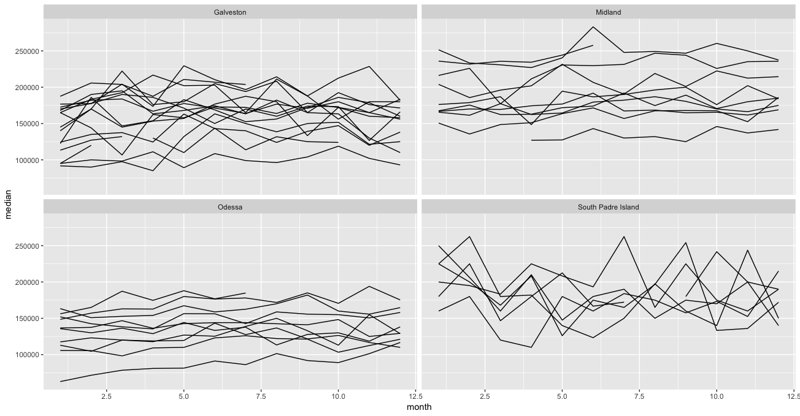

class: bottom, left
background-image: url(plotly-for-r.svg)
background-size: contain

# Welcome

## Thanks for coming!

<style>
.principles {
  font-size: 150%;
}
</style>

---
class: inverse, center, middle
background-image: url(../your-turn.jpeg)
background-size: contain

## Your turn

(1) Go to this address <https://rstudio.cloud/project/14090>. Follow the directions you see in the 'hello.R' script.

(2) Share (w/ your neighbor) 3 things you're hoping to take away from this workshop (share them via Slack if you like!)


---
class: middle

<h3 align="center"> About me </h3>

* PhD in statistics at Iowa State with Heike Hofmann & Di Cook (Dec 2016) 
  
  * Thesis: [Interfacing R with web technologies](http://lib.dr.iastate.edu/etd/15422/)
  
* CEO of [Sievert Consulting](https://consulting.cpsievert.me/) LLC (Jan 2017)

  * Clients: plotly, NOAA, Sandia Labs, O'Reilly
  
* I `r emo::ji("heart")` interactive data visualization
  
  * Maintain/author R `r emo::ji("package")`s: plotly, LDAvis, animint

```{r, include = FALSE}
library(plotly)
knitr::opts_chunk$set(
  eval = FALSE,
  message = FALSE,
  warning = FALSE,
  comment = "#>",
  collapse = TRUE,
  fig.width = 12,
  fig.height = 6
)
```

---
background-image: url(workflow.svg)
background-size: contain
class: inverse

# Data science workflow


---
background-image: url(workflow1.svg)
background-size: contain
class: inverse

## Web graphics are great for presentation!

<br />
<br />
<br />
<br />
<br />
<br />
<br />
<br />
<br />
<br />
<br />
<br />
<br />
<br />
<br />

### Sharable, portable, composable (i.e., reports, dashboards, etc)


---
background-image: url(workflow2.svg)
background-size: contain
class: inverse

## Web technologies aren't designed for this iteration!

<br />
<br />
<br />
<br />
<br />
<br />
<br />
<br />
<br />
<br />
<br />
<br />
<br />
<br />
<br />
<br />

### Follow-up questions (ignited through visualization) may rely on sophisticated computations

---
class: principles

## ...but interactivity augments exploration

* Identify structure that otherwise goes missing ([Tukey 1972](http://stat-graphics.org/movies/prim9.html)).
    
* Search for information quickly without fully specified questions<sup>1</sup> ([Unwin & Hofmann, 2000](https://www.researchgate.net/publication/2425912_GUI_and_Command-line_-_Conflict_or_Synergy))
    * Multiple linked views are the optimal framework for posing queries about data ([Buja, Cook, & Swayne 1996](https://www.jstor.org/stable/1390754))
    
* Diagnose, compare, and understand models ([Wickham, Cook, & Hofmann 2015](http://onlinelibrary.wiley.com/doi/10.1002/sam.11271/abstract)).

.footnote[
---

[1]: Worried about inference? See visual ([Majumder et al 2013](http://amstat.tandfonline.com/doi/abs/10.1080/01621459.2013.808157?journalCode=uasa20#.Wl01_ZM-dTY)) and post-selection ([Berk et al 2013](https://projecteuclid.org/euclid.aos/1369836961)) inference frameworks.
]


---
background-image: url(workflow2.svg)
background-size: 400px
background-position: 90% 8%
class: inverse, middle, center

## Interactive graphics can <font color="red">augment exploratory analysis</font>, but are only practical when we can <font color="red">iterate quickly</font>

---
background-image: url(workflow1.svg)
background-size: 400px
background-position: 90% 8%
class: inverse, middle, center

## Interactive graphics can <font color="red">enhance presentation</font>, but are only practical when <font color="red">deployed easily</font>

---
background-image: url(https://talks.cpsievert.me/20180515/server-client.svg)
background-size: contain
class: middle, right

# When is a web application necessary?

---
background-image: url(https://talks.cpsievert.me/20180515/server-client-dim.svg)
background-size: contain
class: middle, right

# Easier to share, scale, and maintain

---
background-image: url(https://talks.cpsievert.me/20180515/server-client-dim.svg)
background-size: contain
class: middle, right

# What can plotly do in a standalone page?

---
## An example of (standalone) linked views

<iframe src="https://talks.cpsievert.me/20180202/txmissing.html" width="100%" height="485" scrolling="no" seamless="seamless" frameBorder="0"> </iframe>

---
background-image: url(https://talks.cpsievert.me/20171207/pipeline.svg)
background-size: contain
class: bottom, left 

## "Linking as a <br> database query"

---
class: inverse, middle, principles
background-image: url(../your-turn.jpeg)
background-size: contain

<h2 align="center"> Your Turn </h2>

Think of a question you'd like to answer using familiar data. Think of a (linked) graphic that could help address the question (bonus: draw it)!

.footnote[
---

Time: 5 minutes

Feel free to introduce me to your personal projects!
]


---
## Texas housing prices

```{r echo = FALSE, eval = FALSE}
data(txhousing, package = "ggplot2")
tx <- txhousing %>%
  select(city, year, month, median) %>%
  filter(city %in% c("Galveston", "Midland", "Odessa", "South Padre Island"))
```

```r
tx
```

```r
#> # A tibble: 748 x 4
#>    city       year month median
#>    <chr>     <int> <int>  <dbl>
#>  1 Galveston  2000     1  95000
#>  2 Galveston  2000     2 100000
#>  3 Galveston  2000     3  98300
#>  4 Galveston  2000     4 111100
#>  5 Galveston  2000     5  89200
#>  6 Galveston  2000     6 108600
#>  7 Galveston  2000     7  99000
#>  8 Galveston  2000     8  96200
#>  9 Galveston  2000     9 104000
#> 10 Galveston  2000    10 118800
#> # ... with 738 more rows
```

#### Can month help explain (median) price?

---
### Price versus month

```r
library(ggplot2)
ggplot(tx, aes(month, median, group = year)) +
  geom_line() +
  facet_wrap(~city, ncol = 2)
```

<div align="center">
  
</div>

---
### Query specific years

```r
library(plotly)
*TX <- highlight_unit(tx, ~year)
p <- ggplot(TX, aes(month, median, group = year)) + geom_line() +
  facet_wrap(~city, ncol = 2)
*ggplotly(p, tooltip = "year")
```

<a href="08-small-multiples.html" target="_blank">
<div align="center">
  
</div>
</a>

---
## Set selection mode and default selections

```r
highlight(.Last.value, "plotly_hover", defaultValues = "2006")
```

<a href="08-modes.html" target="_blank">
<div align="center">
  
</div>
</a>


---
## Make comparisons with dynamic brush

```{r}
highlight(.Last.value, dynamic = TRUE, persistent = TRUE, selectize = TRUE)
```

<a href="08-dynamic.html" target="_blank">
<div align="center">
  
</div>
</a>

---
## Customize the appearance of selections

```r
highlight(
  .Last.value, dynamic = TRUE, persistent = TRUE, 
*  selected = attrs_selected(mode = "markers+lines", marker = list(symbol = "x"))
)
```

<a href="08-custom.html" target="_blank">
  <div align="center">
    
  </div>
</a>

---
## Automate queries via animation

```r
p <- ggplot(tx, aes(month, median)) + 
  geom_line(aes(group = year), alpha = 0.2) +
*  geom_line(aes(frame = year), color = "red") +
  facet_wrap(~city, ncol = 2)
ggplotly(p)
```

<a href="08-automate.html" target="_blank">
<div align="center">
  
</div>
</a>

---
class: middle, inverse
background-image: url(https://i.imgur.com/Id2nVFG.gif)
background-size: contain

# Generally useful for comparing within/across panels!

---
class: inverse, middle, principles
background-image: url(../your-turn.jpeg)
background-size: contain

<h2 align="center"> Your Turn </h2>

Run the following R code:

```r
demo("crosstalk-highlight-epl-2", package = "plotly")
```

This generates the soccer visualization. Compare the performance of 'Liverpool' with 'Chelsea'. What other info can you extract from this graphic?

.footnote[
Time: 5 minutes


Bonus: Read the code. How does it work?
]

---
class: center
background-image: url(tidyverse.png)
background-size: contain


---
background-image: url(workflow2.svg)
background-size: 400px
background-position: 90% 8%
class: inverse, middle, center

## No matter how complex and polished the individual operations are, it is often the quality of the glue that most directly determines the power of the system.

— Hal Abelson

.footnote[
Quoted in the [tidyverse manifesto](https://cran.r-project.org/web/packages/tidyverse/vignettes/manifesto.html)
]

---
class: inverse
background-image: url(workflow-tidy.svg)
background-size: contain

## What binds the *tidy*-verse?


<br />
<br />
<br />
<br />
<br />
<br />
<br />
<br />
<br />
<br />
<br />
<br />
<br />
<br />
<br />
<br />
<br />

### [Tidy data](https://www.jstatsoft.org/article/view/v059i10) principle: each observation in a row, each variable in a column.

---

# What is the observational unit?

<a href="sf-us-ggplotly-tooltip.html" target="_blank">
<div align="center">
  
</div>
</a>

---

## The data frame is more than a table!

<div align="center" >
  
</div>

.footnote[
List-columns are useful for working "non-tidy data" with tidy tools, see:
1. [Data rectangling](https://www.rstudio.com/resources/videos/data-rectangling/)
2. [Working with many models](https://www.youtube.com/watch?v=rz3_FDVt9eg)
]

---

* The [simple features](https://cran.r-project.org/package=sf) (**sf**) package applies tidy data principles to geo-spatial features.

* The __albersusa__ package provides access to US boundaries as simple featues:

```r
library(albersusa)
usa <- usa_sf("laea")
View(usa)
```

<div align="center">
  
</div>


---

```r
subplot(
  ggplot(usa) + geom_sf(),
  ggplot(usa) + geom_sf(aes(fill = pop_2010))
)
```

<a href="sf-us-ggplotly-subplot.html" target="_blank">
<div align="center">
  
</div>
</a>

---

#### Customize the tooltip

```r
usa$txt <- with(usa, paste("The state of", name, "had \n", pop_2010, "people in 2010"))
p <- ggplot(usa) + geom_sf(aes(fill = pop_2010, text = txt)) 
(gg <- ggplotly(p, tooltip = "text"))
```

<a href="sf-us-ggplotly-tooltip.html" target="_blank">
<div align="center">
  
</div>
</a>


---
class: inverse, middle, principles
background-image: url(../your-turn.jpeg)
background-size: contain

<h2 align="center"> Your turn </h2>

In our cloud project, run 

```r
file.edit("~/usa.R")
```

Walk through the code, complete the tasks, and discuss with a neighbor!

.footnote[
Time: 10 minutes
]

---

<h2 align="center"> plotly is much more than ggplotly! </h2>

#### Initiate a plotly graph (without ggplot2):

* `plot_ly()`: non-ggplot2 interface to underlying [plotly.js](https://github.com/plotly/plotly.js) library
* `plot_mapbox()`: `plot_ly()` wrapper/shortcut for [scattermapbox](https://plot.ly/r/scattermapbox/)
* `plot_geo()`: `plot_ly()` wrapper/shortcut for [scattergeo](https://plot.ly/r/choropleth-maps/)

#### Add data (i.e., traces) to a graph

* `add_markers()`, `add_bars()`, etc (see [`help(add_trace)`](https://www.rdocumentation.org/packages/plotly/versions/4.7.1/topics/add_trace) for full list)

#### Modify a graph (before printing)

* `style()` to modify traces of an existing plotly graph
* `layout()` to add/modify to a [layout component](https://plot.ly/r/reference/#layout)

#### Tools for talking with plotly cloud

* Send data and/or graphs with `api_create()`
* Retrieve data and/or graphs with `api_download_plot()`/`api_download_grid()`
* Do anything the [plotly's server API](https://api.plot.ly/v2/) supports with `api()`

---
## A minimal bar chart

* Every **plotly** chart is powered by [plotly.js](https://github.com/plotly/plotly.js), *plus some extra R/JS magic* `r emo::ji("tophat")` `r emo::ji("rabbit")`.
* `plot_ly()` is designed to default to sensible graphs

```{r}
plot_ly(x = c("A", "B"), y = 1:2)
```

<iframe src="01-simple-bar.html" width="100%" height="300" scrolling="no" seamless="seamless" frameBorder="0"> </iframe>

What actually happens when a plotly object is printed and rendered locally?

---
class: inverse
background-image: url(printing.svg)
background-size: contain

---
class: inverse, middle
background-image: url(../your-turn.jpeg)
background-size: contain

<h2 align = "center"> Your Turn </h2>

* Enter in the console: `plot_ly(diamonds, x = ~cut, color = ~clarity)`
  * What information does this visualize? For context, see [`help(diamonds)`](https://www.rdocumentation.org/packages/ggplot2/versions/2.2.1/topics/diamonds)
  * What is the R console message trying to tell you?
  * What happens if you change `color` to `y`? Can you make a `"histogram2dcontour"` chart?
  
* Use `api_create()` to send this diamonds graph to your plotly account ([sign up](https://help.plot.ly/how-to-sign-up-to-plotly/))
  * Go to the JSON tab -- how many traces does this chart have?
  * Improve the labelling on this chart (use the 'Style' menu)
  
.footnote[
Time: 5-10 minutes
]


---
class: middle

<h2 align="center"> Demo </h2>

Follow along with me:

```r
file.edit("~/workshops/20180609/slides/day1/demo.R")
```

These examples help us to understand how `plot_ly()` works.


---
## Which visualization is better?

```{r, code=readLines("03-heatmap.R")}
```

<a href="03-heatmap.html" target="_blank">
<div align="center">
  
</div>
</a>


---
background-image: url(bostock-heer-groups.png)
background-size: contain

## Famous question: which is larger (and by how much)? <font color="#DEE5FF">A</font> or <font color="#FDDFA4">B</font>?

.footnote[
These questions drive at least two influential papers:

* [Cleveland and McGill (1984)](http://info.slis.indiana.edu/~katy/S637-S11/cleveland84.pdf)
* [Bostock and Heer (2010)]()

This figure is from [Data Visualization for Social Science](http://socviz.co/) (highly recommended!) in reference to Bostock and Heer.
]

---
background-image: url(bostock-heer-findings.png)
background-size: contain

## Position is best, especially along common scale and baseline

.footnote[
Figure from [Heer and Bostock (2010)](http://vis.stanford.edu/files/2010-MTurk-CHI.pdf)
]

---
background-image: url(hierarchy.png)
background-size: contain

## A more general guideline from Cleveland and McGill 

.footnote[
* Figure from [Data Points: Visualization That Means Something](https://issuu.com/wiley_publishing/docs/data_points_sample_a15b4e87f1b924) by Nathan Yau
]

---
class: center, inverse, middle

# Interactive techniques can aid in these tasks

---
## Again, which is better?

<a href="03-heatmap.html" target="_blank">
<div align="center">
  
</div>
</a>


---
background-image: url(https://i.imgur.com/bdd64us.gif)
background-size: contain
class: inverse

<br />
<br />
<br />
<br />
<br />
<br />
<br />
<br />
<br />
<br />
<br />
<br />
<br />


## &nbsp; &nbsp; &nbsp; &nbsp; &nbsp; &nbsp; &nbsp; &nbsp; &nbsp; Graphing 5 time series 

## &nbsp; &nbsp; &nbsp; &nbsp; &nbsp; &nbsp; &nbsp; &nbsp; &nbsp; &nbsp; &nbsp;&nbsp; &nbsp; &mdash;&mdash;&mdash;&mdash;&mdash;&mdash;&mdash;&mdash;&mdash;&mdash;

---
background-image: url(https://i.imgur.com/bdd64us.gif)
background-size: contain
class: inverse

<br />
<br />
<br />
<br />
<br />
<br />
<br />
<br />
<br />
<br />
<br />
<br />
<br />


## &nbsp; &nbsp; &nbsp; &nbsp; &nbsp; &nbsp; &nbsp; &nbsp; &nbsp; Graphing 5 time series 

## &nbsp; &nbsp; &nbsp; &nbsp; &nbsp; &nbsp; &nbsp; &nbsp; &nbsp; &nbsp; &nbsp;&nbsp; &nbsp; &mdash;&mdash;&mdash;&mdash;&mdash;&mdash;&mdash;&mdash;&mdash;&mdash;

<h1 align="right"> 1,000 time series!</h2>

---
## With all my `installed.packages()`, yikes!

```r
plot_ly(logz, x = ~date, y = ~count) %>% 
  group_by(package) %>% 
  add_lines(alpha = 0.3)
```

<a href="04-lines.html" target="_blank">
<div align="center">
  
</div>
</a>

---
## Can improve a bit with interaction

```r
library(crosstalk)
highlight_unit(logz, ~package, "Select package(s)") %>% 
  plot_ly(x = ~date, y = ~count) %>% group_by(package) %>% add_lines(alpha=0.3) %>% 
  highlight(dynamic = TRUE, selectize = TRUE, persistent = TRUE)
```

<a href="04-lines-b.html" target="_blank">
<div align="center">
  
</div>
</a>

---
## [heatmaply](https://github.com/talgalili/heatmaply#readme) is awesome for visualizing a numeric matrices!

<a href="05-heatmaply.html" target="_blank">
<div align="center">
  
</div>
</a>

---
background-image: url(https://i.imgur.com/bdd64us.gif)
background-size: contain
class: inverse

<br />
<br />
<br />
<br />
<br />
<br />
<br />
<br />
<br />
<br />
<br />
<br />
<br />


## &nbsp; &nbsp; &nbsp; &nbsp; &nbsp; &nbsp; &nbsp; &nbsp; &nbsp; Graphing 1,000 time series 

## &nbsp; &nbsp; &nbsp; &nbsp; &nbsp; &nbsp; &nbsp; &nbsp; &nbsp; &nbsp; &nbsp;&nbsp; &nbsp; &mdash;&mdash;&mdash;&mdash;&mdash;&mdash;&mdash;&mdash;&mdash;&mdash;

---
background-image: url(https://i.imgur.com/bdd64us.gif)
background-size: contain
class: inverse

<br />
<br />
<br />
<br />
<br />
<br />
<br />
<br />
<br />
<br />
<br />
<br />
<br />


## &nbsp; &nbsp; &nbsp; &nbsp; &nbsp; &nbsp; &nbsp; &nbsp; &nbsp; Graphing 1,000 time series 

## &nbsp; &nbsp; &nbsp; &nbsp; &nbsp; &nbsp; &nbsp; &nbsp; &nbsp; &nbsp; &nbsp;&nbsp; &nbsp; &mdash;&mdash;&mdash;&mdash;&mdash;&mdash;&mdash;&mdash;&mdash;&mdash;

<h1 align="right"> 1,000,000 time series!</h2>

---
class: center, middle

# Overview first, then zoom and filter, then details on demand 

Ben Shneiderman

.footnote[
Popular information visualization perspective
]

---
class: center, inverse, middle

# Visualization surprise, but don't scale well. Models scale well, but don't surprise

Hadley Wickham

.footnote[
Popular statistical graphics perspective
]

---
class: inverse, middle
background-image: url(../your-turn.jpeg)
background-size: contain

<h2 align="center"> Your turn </h2>

Have a look at some plotly "extension" packages!
  * [heatmaply](https://github.com/talgalili/heatmaply#readme)
  * [iheatmapr](https://github.com/ropensci/iheatmapr#readme)
  * [visdat](http://visdat.njtierney.com/articles/experimental_features.html#interactivity)
  * [vistime](https://github.com/shosaco/vistime#readme)
  * [ggplotgui](https://github.com/gertstulp/ggplotgui#readme)
  
  
.footnote[
**Exercise**: Most of these packages have a function that returns a plotly object (e.g., `heatmaply::heatmaply()`). Use a plotly function to modify/customize the result (e.g., add a title with `plotly::layout()`) 

For all CRAN packages that use plotly, see the "Reverse dependencies" section on <https://cran.r-project.org/package=plotly>
]

---
## What about *long* time series?

* *Tens* of thousands points is responsive with *SVG*

```{r, code=readLines("06-rangeslider.R")}
```

<a href="06-rangeslider.html" target="_blank">
 <div align="center">
   
 </div>
</a>

---
## What about *long* time series?

* *Hundreds* of thousands time series points is responsive with *WebGL*

```{r, code=readLines("07-webgl.R")}
```

<a href="07-webgl.html" target="_blank">
 <div align="center">
   
 </div>
</a>

---
## What about performance (beyond time-series)?

### SVG vs Canvas, in general

* The *Scalable* in SVG, means scalable in terms of bounding box size.
  * No matter the context, your browser will struggle to render > 30,000 SVG elements.
  * This is why [canvas based elements](https://en.wikipedia.org/wiki/Canvas_element) exist (the difference is similar to pdf vs png)
  
#### Time series doesn't scale well, even in a canvas context 

* Time series has performance limitations that other data types don't (this is pretty universal).

### High performance plotly charts

* scattergl -- basically same as scatter (with [limitations](https://github.com/plotly/plotly.js/issues/130)), but [responsive with >1M points](scattergl.R).
* pointcloud -- more restricted than scattergl, but [responsive w/ several million points](pointcloud.R).
* heatmapgl -- [response with >1M cells](heatmapgl.R) in heatmap.

---
## More time series tips

#### Have *lots* of *long* time series?

* Consider [extracting/visualizing features from each series](https://robjhyndman.com/talks/Google-Oct2015-part3.pdf)
  * Some useful packages: [anomalous](https://github.com/robjhyndman/anomalous) and [tscognostics](https://github.com/earowang/tscognostics)
  * See my work on [visualizing pedestrian traffic](https://github.com/cpsievert/pedestrians) with plotly
  
* Consider a tool like [trelliscope](http://ryanhafen.com/blog/trelliscopejs-plotly) for exploring many "groups"

#### Visualization of models/predictions?

* Start with [forecast](https://cran.r-project.org/package=forecast) and/or [mgcv](https://cran.r-project.org/package=mgcv) for model fitting.
* Use a strategy similar to [here](https://plotly-book.cpsievert.me/a-case-study-of-housing-sales-in-texas.html#fig:forecast) to plot forecasts.

#### Is seasonality important?

* Consider "wrapping" your time-series 
  * Wrap (i.e., group) your series by hand (get inspired by this [paper](https://arxiv.org/pdf/1412.6675.pdf))
  * Checkout out [sugrrants](https://github.com/earowang/sugrrants) (`ggplotly()` converts the ggplot2 plots)

---
class: inverse, center, middle
background-image: url(../your-turn.jpeg)
background-size: contain


## Your turn

Remember [this](#15) "your turn"? Let's try to make that idea a reality!


.footnote[
## Now would be a good time to ask me about personal projects!
]
